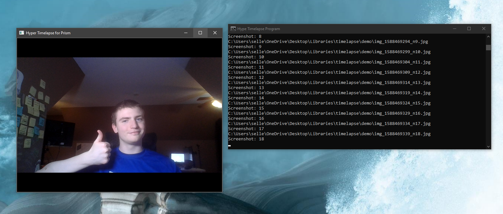

# Hyper Timelapse Program
Designed for the Hype Industries Prism Weapon Detection. This Python based program will take timelapse of any camera input that can connect to openCV. It it is very simple to use.




There are 3 options to the command line interface. You can run `python index.py --help` to get information about the commands. Also press `Esc` to exit program.

**Output Directory (required)**<br>
You must provide an output directory, this directory can be either relative or absolute. Use `--output` or `-o` to set this argument.

**Delay (required)**<br>
This is the time between photos in seconds. This can either be set as a whole integer or a float. Therfore `20` which is a photo taken every 20 seconds or `0.2` which is a photo taken 5 times per second will work. Don't go past the frame rate of your camera. I would not recommend any frame delay below `0.2`, as this is just a video, and Time-lapse doesn't compress the images.

**Camera (optional)**<br>
The camera address can either be represented by an integer which represents local web cameras (starting at `0`) or an IP Camera address. IP cameras can be accessed either from the HTTP/HTTPS or RTSP protocols (We use OpenCV2 for video capture). For example to access a JPG stream from an IP Camera the address might be `http://192.169.1.19:8080/video`. This option is not required and the default option is `0` which should be your web camera.

**Motion (optional)**<br>
The motion flag will only save the image if there is a difference between the last frame captured. This means if you have a delay of 5 seconds and there is not difference between frame 1 and frame 2, 5 seconds later frame 2 will not be saved. You can also set the sensitivity using `-s` or `--sensitivity`. The default is `0.02`, and we don't recommend going above `0.05`. The sensitivity must be below `1`.

#### Examples
```
python index.py --output demo --delay 5
python index.py --output demo --delay 5 --motion
python index.py --output demo --delay 5 --motion --sensitivity 0.3
```
